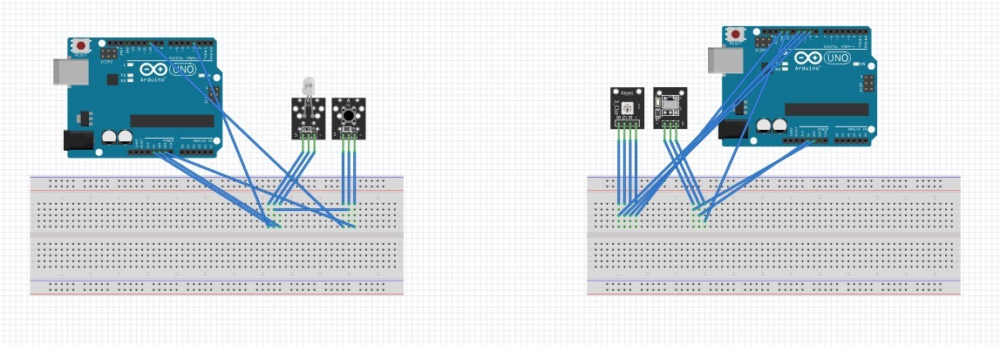

# iris
Reliable, secure infrared communication between Arduinos.

## Materials
1. Arduino Uno (x2)
2. Breadboard
3. Jumper Wires (M/M)
4. KY-005 Infrared Transmitter Module
5. KY-022 Infrared Receiver Module
6. Button
7. RGB LED

## Instructions
1. Create Arduino setups using the schematics shown above. Look at the image of the schematics or download the Fritzing file (.fzz) from the schematics folder
2. For the Arduino with the Infrared Receiver, upload "irreceive.ino"
3. For the Arduino with the Infrared Transmitter, upload "irsend.ino"
4. Press the button and watch the LED wirelessly flash!

ALTERNATIVELY: use any infrared TV-remote control (any button) to activate the LED
